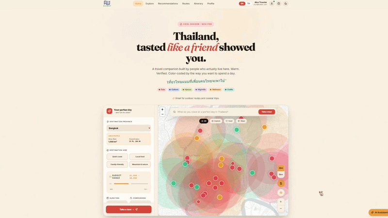

<h1 align="center">
  <a href="#">
    <picture>
      <source height="160" media="(prefers-color-scheme: dark)" srcset="./apps/web/src/assets/light.png">
      
    </picture>
  </a>
  <br>
  <a href="#">
    
  </a>
  <a href="#">
    
  </a>
  <a href="#">
    
  </a>
  <a href="#">
    
  </a>
  <a href="#">
    
  </a>
</h1>

<p align="center">
  <em><b>AllWay</b> is an AI trust layer for safer local travel in Thailand, helping tourists choose where to go, what to trust, and which options fit their trip best.</em>
</p>

---

# AllWay Thailand 🇹🇭

**Super AI Engineer SS6 by AiAT | Hackathon Project**

> AI Trust Layer for Safer Local Travel in Thailand

AllWay is not a booking super-app. It is an **AI trust layer** that helps tourists decide where to go next, what to trust, and which local packages are safer and more suitable — starting with Bangkok and nearby continuation trips.

## Architecture Preview


## Video Demo




## Team 5 Houses · 5 disciplines · 1 mission

- **Ratchanon Buachum** (Non) - Engineering (EXP) : [@nonnnz](https://github.com/nonnnz)
- **Worapat Punsawat** (Palm) - Design (Kiddee) : [@PalmWorapat](https://github.com/PalmWorapat)
- **Narathip Wongpun** (Earth) - Data (Pangpuriye) : [@earth-repo](https://github.com/earth-repo)
- **Kriengkrai Phongkitkarun** (Heng) - Business (Machima) : [@hengkp](https://github.com/hengkp)
- **Kornkit Thansuawnkul** (Namtarn) - Data (Scamper) : [@thanstore22-cpu](https://github.com/thanstore22-cpu)

---

## Web Pages Quick Table

| Page File | Route | Purpose |
| --- | --- | --- |
| [`Index.tsx`](#shot-index) | `/` | Landing page with AI-style travel controls, map, and trending places |
| [`Explore.tsx`](#shot-explore) | `/explore` | Filterable browse page (list/map) for places |
| [`Recommendations.tsx`](#shot-recommendations) | `/recommendations` | AI detour recommendations from user intent/vibe |
| [`PlaceDetail.tsx`](#shot-place-detail) | `/place/:id` | Full place detail, trust/fair-price/culture, report, save-to-itinerary |
| [`Itinerary.tsx`](#shot-itinerary) | `/itinerary` | Trip planner, calendar timeline, edit items, export calendar |
| [`Routes.tsx`](#shot-routes) | `/routes` | Saved itineraries overview + AI smart routes |
| [`Profile.tsx`](#shot-profile) | `/profile` | User preferences and submitted reports history |
| [`AdminDashboard.tsx`](#shot-admin-dashboard) | `/admin/dashboard` | Admin tabs for risk queue, AI logs, and data jobs |
| [`AdminRiskQueue.tsx`](#shot-admin-risk-queue) | `/admin/risk-queue` | Focused admin risk triage table |
| [`NotFound.tsx`](#shot-not-found) | `*` | 404 fallback page |

---

## Monorepo Structure

```
AllWay/
├── apps/
│   ├── web/          # Vite + React + Tailwind (SSR-ready)
│   ├── api/          # ElysiaJS (TypeScript) backend
│   └── etl/          # Python ETL scripts (TAT API → PostgreSQL → Neo4j)
├── packages/
│   └── shared/       # Shared types/constants between web & api
├── docs/             # SDD documents
├── docker-compose.yml
└── README.md
```

---

## Quick Start

### Prerequisites

- Node.js 20+
- Bun (for ElysiaJS)
- Python 3.11+
- Docker (for local PostgreSQL)
- Neo4j AuraDB free tier account

### 1. Clone & install

```bash
# Install API deps
cd apps/api && bun install

# Install web deps
cd apps/web && npm install

# Install ETL deps
cd apps/etl && pip install -r requirements.txt
```

### 2. Setup environment

```bash
cp .env.example .env
# Fill in your secrets (see .env.example)
```

### 3. Start local services

```bash
docker-compose up -d   # starts PostgreSQL
```

### 4. Run ETL (seed data)

```bash
cd apps/etl
python run_all.py
```

### 5. Start dev servers

```bash
# Terminal 1 - API
cd apps/api && bun dev

# Terminal 2 - Web
cd apps/web && npm run dev
```

---

## Deployment (POC)

| Service        | Where                          |
| -------------- | ------------------------------ |
| PostgreSQL     | Docker on local PC             |
| Neo4j          | AuraDB Free Tier (cloud)       |
| API (ElysiaJS) | Local PC via Cloudflare Tunnel |
| Web (Vite)     | Local PC via Cloudflare Tunnel |
| ETL            | Python cronjob on local PC     |

Cloudflare Tunnel exposes local ports publicly without opening firewall ports.

---

## Docs

See [`/docs`](./docs/) for full Specification-Driven Development docs.

---

## Web Pages Guide (`apps/web/src/pages`)

| Page File | Route | Purpose | Screenshot |
| --- | --- | --- | --- |
| `Index.tsx` | `/` | Landing page with AI controls, map, and trending places | [Jump](#shot-index) |
| `Explore.tsx` | `/explore` | Filterable browse page with list/map views | [Jump](#shot-explore) |
| `Recommendations.tsx` | `/recommendations` | AI detour recommendations from intent/vibe | [Jump](#shot-recommendations) |
| `PlaceDetail.tsx` | `/place/:id` | Place details, trust, fair-price, culture, report/save actions | [Jump](#shot-place-detail) |
| `Itinerary.tsx` | `/itinerary` | Trip planner, calendar timeline, export tools | [Jump](#shot-itinerary) |
| `Routes.tsx` | `/routes` | Saved itineraries and AI route plans | [Jump](#shot-routes) |
| `Profile.tsx` | `/profile` | Preferences and user report history | [Jump](#shot-profile) |
| `AdminDashboard.tsx` | `/admin/dashboard` | Admin risk, AI logs, and data jobs dashboard | [Jump](#shot-admin-dashboard) |
| `AdminRiskQueue.tsx` | `/admin/risk-queue` | Focused admin risk triage table | [Jump](#shot-admin-risk-queue) |
| `NotFound.tsx` | `*` | 404 fallback page | [Jump](#shot-not-found) |

### Screenshot Gallery

<a id="shot-index"></a>
#### `Index.tsx`


<a id="shot-explore"></a>
#### `Explore.tsx`


<a id="shot-recommendations"></a>
#### `Recommendations.tsx`


<a id="shot-place-detail"></a>
#### `PlaceDetail.tsx`


<a id="shot-itinerary"></a>
#### `Itinerary.tsx`


<a id="shot-routes"></a>
#### `Routes.tsx`


<a id="shot-profile"></a>
#### `Profile.tsx`


<a id="shot-admin-dashboard"></a>
#### `AdminDashboard.tsx`


<a id="shot-admin-risk-queue"></a>
#### `AdminRiskQueue.tsx`


<a id="shot-not-found"></a>
#### `NotFound.tsx`


### Screenshot Folder Convention

- Recommended location: `docs/screenshots/web/`
- Suggested file names:
- `home-index.png`
- `explore.png`
- `recommendations.png`
- `place-detail.png`
- `itinerary.png`
- `routes.png`
- `profile.png`
- `admin-dashboard.png`
- `admin-risk-queue.png`
